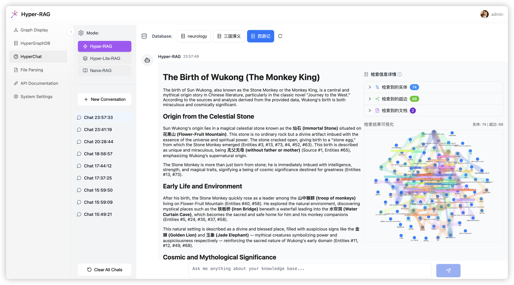
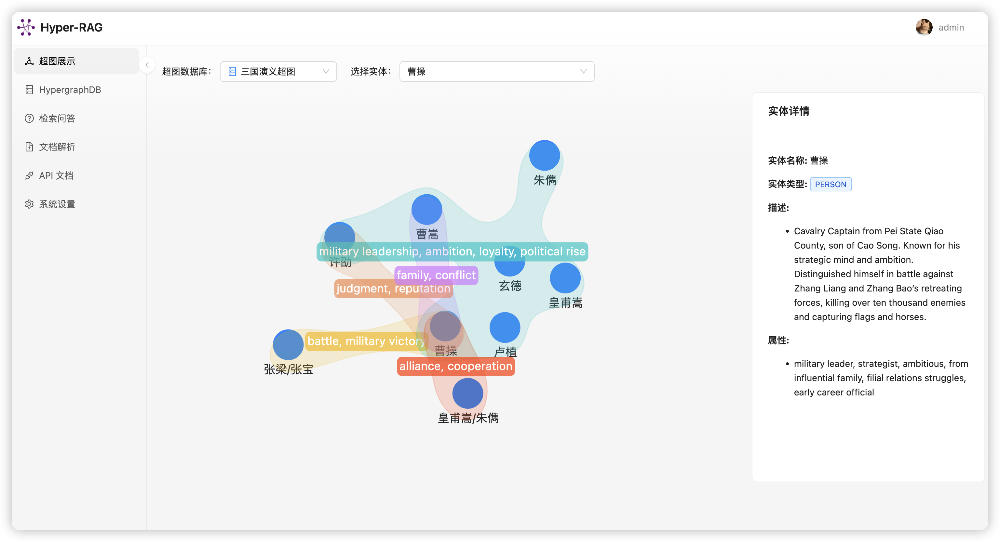
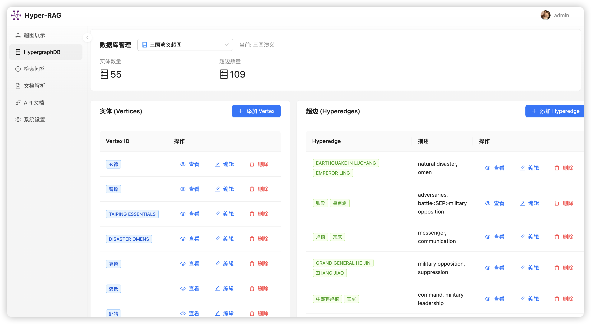
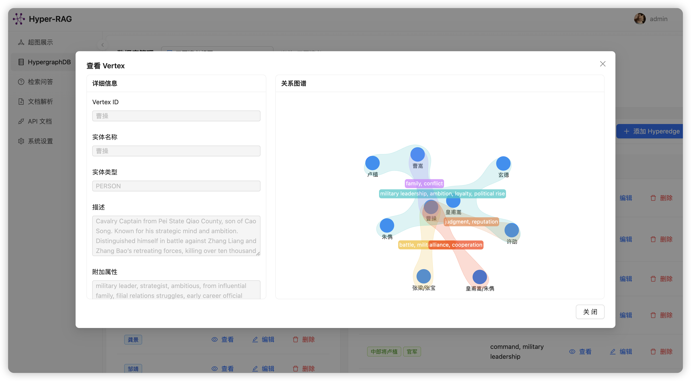
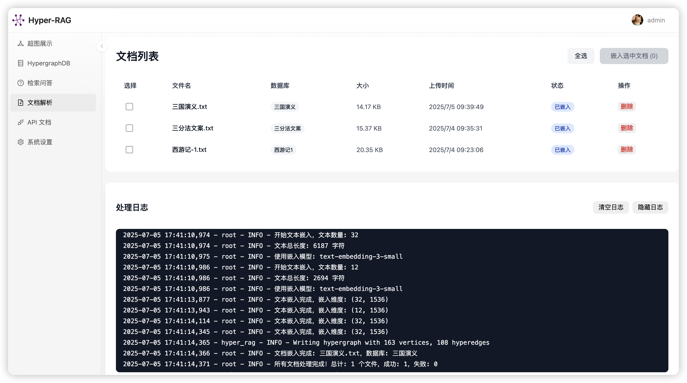
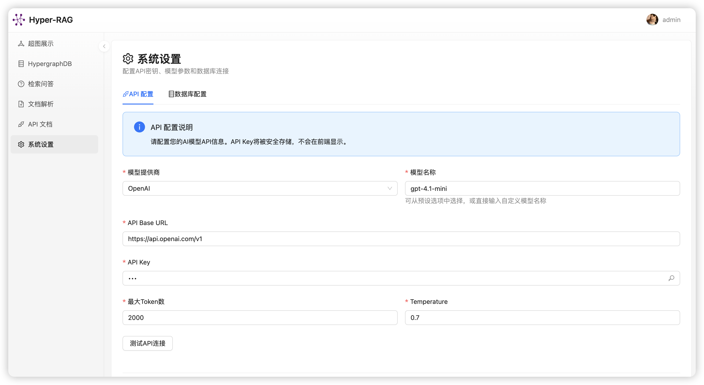
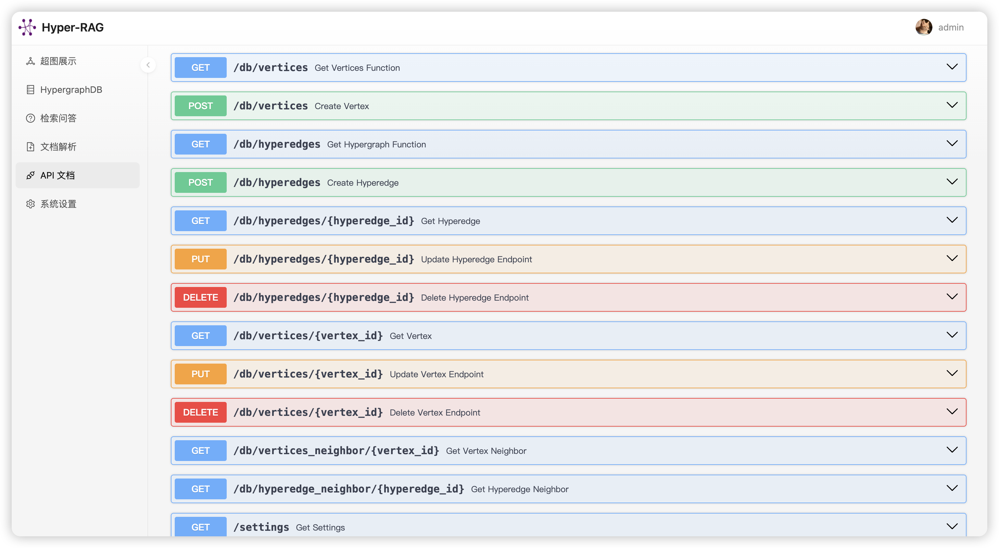

# HyperRAG Web UI

HyperRAG Web UI is a full-stack web application based on React + FastAPI, providing a complete visualization interface and management features for the HyperRAG system.

## 📖 Project Overview

HyperRAG Web UI provides an intuitive web interface for managing and using the HyperRAG system, including hypergraph visualization, document management, retrieval Q&A, and more.

## 🚀 Quick Start

### Prerequisites

- Node.js 16+
- Python 3.8+
- npm/yarn

### Backend Setup

1. Navigate to the backend directory:

```bash
cd web-ui/backend
```

2. Install dependencies:

```bash
pip install -r requirements.txt
```

You can download 3 pre-parsed demo databases [here](https://pan.baidu.com/s/1mrDJVpMW59gLtRRSXafXdw?pwd=w642#list/path=%2Fsharelink484952695-6132723540665%2FHyper-RAG%2Fweb-ui&parentPath=%2Fsharelink484952695-6132723540665).

After extraction, copy them to the `web-ui/backend/hyperrag_cache` directory

3. Start the development server:

```bash
fastapi dev main.py
```

### Frontend Setup

1. Navigate to the frontend directory:

```bash
cd web-ui/frontend
```

2. Install dependencies:

```bash
npm install
# or
pnpm install
```

3. Start the development server:

```bash
npm run dev
```

The frontend application will be available at `http://localhost:5173`

## 📱 Interface Preview

### Main Pages

- **Home**: Intelligent chat interface with multi-turn Q&A support
- **Graph Display**: Interactive hypergraph visualization
- **Database Management**: Complete hypergraph data CRUD operations
- **Document Management**: File upload and embedding progress monitoring
- **System Settings**: Model configuration and connection management

## ✨ Main Features

### 🔍 Retrieval Q&A (QA)

- Intelligent chat interface supporting multiple query modes
- Supports three query modes: `hyper`, `hyper-lite`, `naive`
- Conversation history management and persistent storage
  

### 📊 Hypergraph Display (Graph)

- Interactive hypergraph visualization
- Detailed information viewing for nodes and hyperedges
- Dynamic graph layout and zoom functionality
- Hypergraph rendering
  

### 🗄️ HypergraphDB Management (DB)

- Complete hypergraph database management interface
- CRUD operations for Vertices and Hyperedges
- Database switching and state management
- Neighbor node queries and relationship analysis
  
  

### 📁 Document Parsing (Files)

- Drag-and-drop file upload interface
- Supports multiple document formats (PDF, DOCX, TXT, Markdown)
- Real-time document embedding progress display
- WebSocket real-time log monitoring
- Batch document processing and management
  

### ⚙️ System Settings (Setting)

- LLM model configuration (OpenAI, other compatible APIs)
- Embedding model settings and parameter adjustment
- Database connection management
- API connection testing tool
  

### 📚 API Documentation (API)

- Built-in FastAPI auto-generated API documentation
- Interactive API testing interface
- Complete interface descriptions and examples
  

## 🛠️ Tech Stack

### Frontend Technologies

- **React 18** - Main framework
- **Ant Design & Ant Design Pro** - UI component library
- **Radix UI** - Modern UI components
- **AntV G6** - Graph visualization
- **React Router** - Routing management
- **MobX** - State management
- **Tailwind CSS** - Styling framework
- **Vite** - Build tool

### Backend Technologies

- **FastAPI** - Modern Python web framework
- **Uvicorn** - ASGI server
- **Pydantic** - Data validation
- **SQLAlchemy** - ORM
- **WebSocket** - Real-time communication
- **OpenAI API** - LLM integration

## 🔧 Configuration

### Backend Configuration

- **LLM Configuration**: Supports OpenAI and other compatible APIs
- **Embedding Models**: Supports multiple embedding model configurations
- **Database**: Supports multi-database switching
- **Cache**: Automatic cache management

### Frontend Configuration

- **API Address**: Automatic backend service address detection
- **Theme**: Supports light/dark themes
- **Layout**: Responsive design, adapts to various screens

## 🔗 API Documentation

Visit `http://127.0.0.1:8000/docs` to view the complete API documentation, including:

### Core APIs

- `GET /db` - Get hypergraph data
- `POST /hyperrag/query` - Intelligent Q&A query
- `POST /hyperrag/insert` - Document insertion
- `POST /files/upload` - File upload
- `POST /files/embed` - Document embedding

### Management APIs

- `GET /settings` - Get system settings
- `POST /settings` - Save system settings
- `GET /databases` - Get database list
- `POST /test-api` - Test API connection

## 📊 Real-time Monitoring

### WebSocket Support

- Real-time log monitoring
- Document processing progress
- System status updates

### Progress Tracking

- File upload progress
- Embedding processing progress
- Error status alerts
